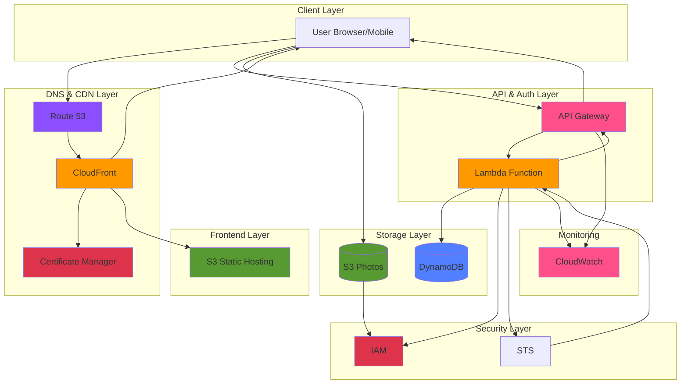

# PhotoSnapPro: Serverless Photo Gallery with Secure Sharing

A modern, serverless web application that allows users to sign up, authenticate, and securely manage and share their photos with time-limited public links. Built entirely on AWS with custom domain, global CDN, and security-first architecture using pre-signed URLs and least-privilege access controls.

**Live Demo:** [https://photosnap.pro](https://photosnap.pro)

## Architecture Diagram


*Figure 1: Serverless architecture utilizing AWS services for authentication, storage, and global content delivery with custom domain and SSL/TLS.*

## Features

### Core Functionality
- **User Authentication:** Secure signup/login with SHA256 password hashing
- **Password Reset:** Token-based password recovery system (15-minute expiry)
- **Photo Upload:** Drag-and-drop or click-to-upload with preview
- **Photo Gallery:** Grid view with hover effects and modal viewer
- **Branded Photo Sharing:** Generate shareable links with marketing viewer (7-day expiry)
- **Photo Deletion:** Secure deletion with confirmation modal

### Security Features
- **Pre-signed URLs:** All S3 operations use temporary, signed URLs - zero credentials in browser
- **Base64 URL Encoding:** Preserves AWS security tokens in share links
- **Least-Privilege IAM:** Per-user IAM roles with folder-level S3 access only
- **STS Temporary Credentials:** 1-hour session tokens for authenticated operations
- **SHA256 Password Hashing:** Passwords never stored in plaintext
- **HTTPS/SSL:** CloudFront with ACM certificate for encrypted traffic

### Infrastructure
- **Custom Domain:** photosnap.pro with Route 53 DNS management
- **Global CDN:** CloudFront distribution for low-latency worldwide access
- **Mobile Responsive:** Desktop and mobile optimized UI
- **Serverless:** Auto-scaling with zero server management
- **Cost-Optimized:** $0.50/month (Route 53 only, everything else free tier)

## Solution Architecture

| **AWS Component** | **Service Layer** | **Primary Function / Role** | 
| :--- | :--- | :--- | 
| **Route 53** | DNS | Custom domain DNS management and routing to CloudFront |
| **CloudFront** | CDN | Global content delivery with SSL/TLS termination and caching |
| **ACM** | Security | SSL/TLS certificate for HTTPS on custom domain |
| **S3 Static Hosting** | Frontend | Hosts static HTML, CSS, and JavaScript files |
| **API Gateway (HTTP API)** | API Layer | Exposes `/auth` endpoint for all backend operations with CORS handling |
| **Lambda** | Backend Logic | Handles authentication, pre-signed URL generation, and photo operations |
| **DynamoDB** | Data Storage | Stores user credentials (hashed), IAM role ARNs, and reset tokens |
| **IAM** | Security | Creates per-user least-privilege roles with folder-level S3 access |
| **STS** | Security | Issues temporary credentials for authenticated S3 operations |
| **S3 Photos Bucket** | Storage | Stores user photos with per-user folder isolation |
| **CloudWatch** | Monitoring | Logs and monitors Lambda executions and API Gateway requests |

## Key Architectural Decisions

### 1. Pre-signed URL Architecture
**Problem:** Initially attempted direct S3 uploads with AWS credentials exposed in browser, causing security vulnerabilities and CORS issues.

**Solution:** Implemented pre-signed URL pattern where:
- Client requests pre-signed URL from Lambda
- Lambda generates time-limited, cryptographically signed S3 URL (5 min for uploads, 1 hour for views, 7 days for shares)
- Client uploads/downloads directly to/from S3 using signed URL
- URL expires automatically, revoking access

**Benefits:**
- Zero AWS credentials in browser/network traffic
- Lambda maintains centralized access control
- Time-limited access prevents unauthorized long-term usage
- Follows AWS security best practices

### 2. Branded Photo Sharing with Marketing Funnel
**Feature:** Users can share photos via public links that display in a branded viewer page with conversion-optimized CTA.

**Implementation:**
- Share button generates viewer URL: `photosnap.pro/viewer.html?u=<base64-encoded-url>`
- Viewer page displays photo with PhotoSnap branding and "Start Free Today" CTA
- Converts photo sharing into marketing opportunity (viral growth loop)

**Technical Details:**
- Lambda `get-share-url` action generates 7-day pre-signed S3 URLs
- Frontend uses Base64 encoding (`btoa()`) to encode S3 URL in query parameter
- Viewer uses Base64 decoding (`atob()`) to extract and display photo
- Base64 encoding prevents AWS security token corruption (preserves `+` signs and special characters)

**Challenge Solved:**
Initial implementation used URL encoding (`encodeURIComponent()`) which converted plus signs in AWS security tokens to spaces, causing `InvalidToken` errors. Base64 encoding preserves all characters perfectly.

### 3. CORS Configuration
**Challenge:** API Gateway's automatic CORS injection failed to apply headers correctly for cross-origin requests.

**Solution:** 
- Configured HTTP API CORS settings with specific origin (`https://photosnap.pro`)
- Lambda explicitly handles OPTIONS preflight requests returning 200 status
- All responses include `Access-Control-Allow-Origin` header
- S3 photos bucket CORS allows GET requests from photosnap.pro

### 4. Custom Domain with CloudFront
**Setup:**
- Domain purchased and nameservers pointed to Route 53
- CloudFront distribution created with S3 website endpoint as origin
- SSL certificate requested via ACM in us-east-1 (required for CloudFront)
- Route 53 A records (alias) point to CloudFront distribution
- Cache invalidation strategy for deployment updates

**Benefits:**
- Professional branding (photosnap.pro vs long S3 URL)
- HTTPS/SSL encryption for security
- Global edge locations for low latency
- Caching improves performance and reduces costs

### 5. Least-Privilege Security Model
Instead of proxying S3 requests through Lambda (costly and high-latency), the application uses:
- **Per-User IAM Roles:** Each user gets dedicated role with access limited to `s3://bucket-name/username/*`
- **STS AssumeRole:** Lambda assumes user's role and returns temporary credentials (1-hour expiry)
- **Direct S3 Access:** Client uploads/downloads directly using temporary credentials

This approach is highly scalable, cost-effective, and follows the principle of least privilege.

### 6. Password Security
- Passwords hashed with SHA256 before storage in DynamoDB
- Reset tokens are 6-digit codes with 15-minute expiration
- Token-based password recovery prevents email dependency

## API Endpoints

**Base URL:** `https://kjencmxwf0.execute-api.us-east-2.amazonaws.com/auth/auth`

All requests are POST with JSON body:

| **Action** | **Description** | **Request Body** | **Response** |
| :--- | :--- | :--- | :--- |
| `signup` | Create new user account | `{action, username, password}` | Success message + IAM role created |
| `login` | Authenticate user | `{action, username, password}` | Temporary credentials + S3 config |
| `request-reset` | Generate password reset token | `{action, username}` | 6-digit token (15 min expiry) |
| `reset-password` | Reset password with token | `{action, username, resetToken, newPassword}` | Success confirmation |
| `get-upload-url` | Get pre-signed upload URL | `{action, username, fileName, fileType}` | Signed PUT URL (5 min expiry) |
| `list-photos` | List user's photos | `{action, username}` | Array of photos with signed GET URLs (1 hr expiry) |
| `get-delete-url` | Get pre-signed delete URL | `{action, username, fileName}` | Signed DELETE URL (5 min expiry) |
| `get-share-url` | Get shareable public link | `{action, username, fileName}` | Signed GET URL (7 day expiry) |

## File Structure

```
photosnap-pro/
├── README.md
├── frontend/
│   ├── index.html          # Main dashboard with auth forms and photo gallery
│   ├── landing.html        # Marketing landing page
│   ├── viewer.html         # Branded photo viewer for shared links
│   ├── styles.css          # Dashboard styling
│   ├── landing.css         # Landing page styling
│   └── app.js              # Frontend logic (auth, upload, share)
└── backend/
    └── lambda/
        └── index.mjs       # Lambda function for all backend operations
```

## Setup and Deployment

### Prerequisites
- AWS Account
- Custom domain (optional but recommended)
- AWS CLI configured

### 1. DynamoDB Setup
```bash
# Create users table
aws dynamodb create-table \
  --table-name PhotoSnapUsers \
  --attribute-definitions AttributeName=username,AttributeType=S \
  --key-schema AttributeName=username,KeyType=HASH \
  --billing-mode PAY_PER_REQUEST
```

### 2. S3 Buckets
```bash
# Frontend bucket
aws s3 mb s3://photosnap-frontend-<account-id>
aws s3 website s3://photosnap-frontend-<account-id> \
  --index-document landing.html

# Photos bucket
aws s3 mb s3://photosnap-photos-<account-id>
```

### 3. Lambda Deployment
1. Create Lambda execution role with permissions:
   - DynamoDB: GetItem, PutItem, UpdateItem
   - IAM: CreateRole, PutRolePolicy
   - STS: AssumeRole
   - S3: PutObject, GetObject, ListBucket, DeleteObject
   - CloudWatch Logs: CreateLogGroup, CreateLogStream, PutLogEvents

2. Deploy Lambda function:
```bash
cd backend/lambda
zip function.zip index.mjs
aws lambda create-function \
  --function-name PhotoSnapAuthFunction \
  --runtime nodejs20.x \
  --role arn:aws:iam::<account-id>:role/PhotoSnapLambdaExecutionRole \
  --handler index.handler \
  --zip-file fileb://function.zip
```

### 4. API Gateway
```bash
# Create HTTP API
aws apigatewayv2 create-api \
  --name PhotoSnapAPI \
  --protocol-type HTTP \
  --cors-configuration AllowOrigins="https://photosnap.pro",AllowMethods="POST,OPTIONS",AllowHeaders="Content-Type"

# Create route and integration
aws apigatewayv2 create-integration \
  --api-id <api-id> \
  --integration-type AWS_PROXY \
  --integration-uri arn:aws:lambda:<region>:<account-id>:function:PhotoSnapAuthFunction

aws apigatewayv2 create-route \
  --api-id <api-id> \
  --route-key "POST /auth" \
  --target integrations/<integration-id>
```

### 5. CloudFront and Custom Domain (Optional)
1. Request SSL certificate in ACM (us-east-1 region)
2. Create CloudFront distribution with S3 website endpoint as origin
3. Configure Route 53 hosted zone for custom domain
4. Create A record (alias) pointing to CloudFront distribution

### 6. Frontend Deployment
```bash
# Upload frontend files to S3
aws s3 cp frontend/ s3://photosnap-frontend-<account-id>/ --recursive

# Invalidate CloudFront cache
aws cloudfront create-invalidation \
  --distribution-id <dist-id> \
  --paths "/*"
```

## Security Considerations

1. **No Credentials in Browser:** Pre-signed URLs eliminate need for AWS credentials in client-side code
2. **Base64 Encoding:** Preserves AWS security tokens in shareable URLs (prevents `+` sign corruption)
3. **Time-Limited Access:** All signed URLs expire automatically (5 min to 7 days depending on operation)
4. **Folder Isolation:** IAM policies restrict users to their own S3 folder only
5. **HTTPS Only:** CloudFront enforces HTTPS, redirecting HTTP requests
6. **CORS Properly Configured:** Prevents unauthorized cross-origin requests
7. **Password Hashing:** SHA256 ensures passwords never stored in plaintext
8. **Token Expiration:** Password reset tokens expire after 15 minutes

## Performance Optimizations

- **CloudFront Edge Caching:** Static assets served from global edge locations
- **Direct S3 Upload:** Files uploaded directly to S3 without Lambda proxy (lower latency)
- **Lazy Loading:** Photos loaded on-demand in gallery view
- **Pre-signed URL Caching:** View URLs valid for 1 hour to reduce Lambda invocations
- **Base64 Encoding:** Lightweight encoding for share URLs (no server processing)
- **Serverless Auto-scaling:** Lambda and API Gateway scale automatically with demand

## Future Enhancements

- Photo albums/collections
- Image compression and thumbnail generation
- Email-based password reset (SES integration)
- Social login (Cognito integration)
- Analytics dashboard (view counts, shares)
- Batch photo operations
- Photo editing capabilities
- Mobile app (React Native)
- Share link analytics (track views)

## Technologies Used

- **Frontend:** Vanilla JavaScript, HTML5, CSS3
- **Backend:** AWS Lambda (Node.js 20.x)
- **Database:** Amazon DynamoDB
- **Storage:** Amazon S3
- **API:** AWS API Gateway (HTTP API)
- **CDN:** Amazon CloudFront
- **DNS:** Amazon Route 53
- **Security:** AWS IAM, AWS STS, AWS ACM
- **Monitoring:** Amazon CloudWatch
- **Encoding:** Base64 for secure URL parameter passing

## Cost Optimization

This serverless architecture is highly cost-effective:
- **Lambda:** Pay per request (1M free requests/month)
- **DynamoDB:** On-demand pricing (no idle costs)
- **S3:** Pay for storage and bandwidth only
- **CloudFront:** Free tier includes 1TB data transfer
- **API Gateway:** Pay per request (1M free requests/month)
- **Route 53:** $0.50/month for hosted zone

**Estimated monthly cost:**
- **Personal use (< 100 users):** $0.50/month
- **Small business (1,000 users):** $5-10/month
- **All within AWS free tier except Route 53**

## License

MIT License - feel free to use this project for learning or commercial purposes.

## Author

Built as a portfolio project demonstrating serverless architecture, AWS security best practices, modern web development, and growth marketing through viral sharing loops.

---

**Created:** November 2025  
**Last Updated:** November 2025
