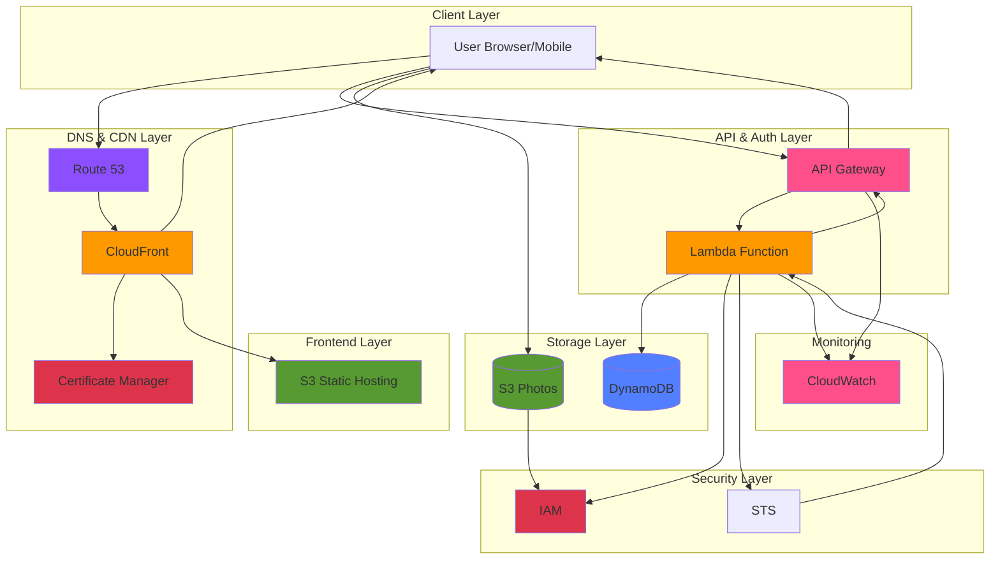

# PhotoSnapPro: Serverless Photo Gallery with Secure Sharing

This project is a modern, serverless web application that allows users to sign up, log in, and securely manage and **share** their own photos stored in a private S3 bucket folder. It is designed following the principle of **least-privilege access** using AWS Identity and Access Management (IAM) and AWS Security Token Service (STS).

## Architecture Diagram

*Figure 1: Serverless architecture utilizing AWS services for authentication, storage, and global content delivery.*

## Solution Architecture

The application is deployed entirely on AWS using a serverless approach. 

| **AWS Component** | **Service Layer** | **Primary Function / Role** | 
| :--- | :--- | :--- | 
| S3 Static Hosting | Frontend | Hosts the static HTML, CSS, and JavaScript. Uses the S3 Website Endpoint URL as the **CORS Origin**. | 
| AWS API Gateway (HTTP API) | Authentication API | Exposes a single `/auth` endpoint. Routes **POST** requests to Lambda and handles **CORS preflight (OPTIONS)**. | 
| AWS Lambda (`authHandler`) | Backend Logic | Executes authentication logic: user creation, password validation, and secure credential generation. | 
| Amazon DynamoDB (`PhotoSnapUsers`) | Data Storage | Stores user credentials (hashed passwords) and the ARN of the user's specific IAM role. | 
| AWS IAM & STS | Security & Access | **IAM** creates least-privilege roles per user. **STS** provides temporary security credentials for direct S3 access. | 
| Amazon S3 (`photosnap-photos...`) | Photo Storage | Stores user photos, secured by IAM policies that only allow access via the temporary credentials. | 

## Key Architectural Decisions

1. **CORS Handling:** The API Gateway's automatic CORS injection failed to apply headers correctly. The issue was resolved by **manually integrating the `OPTIONS` route** to the Lambda and having the Lambda return the necessary CORS headers on a successful preflight status (`200`). 

2. **Least-Privilege Data Access:** Instead of proxying S3 requests through the Lambda (which costs more and adds latency), the application uses **STS `AssumeRole`** to give the authenticated user **temporary, time-limited credentials**. These credentials grant direct S3 access, but only to their specific bucket folder (`s3://${BUCKET_NAME}/${username}/*`). This is highly scalable and secure.

3. **Secure Photo Sharing (Presigned URLs):** To allow authenticated users to share private photos without exposing their S3 credentials or making the bucket public, the application utilizes **S3 Presigned URLs**. The client-side logic generates a time-limited, signed URL for a specific object, allowing anyone with the URL to temporarily access the photo. This prevents permanent public access while enabling sharing.

4. **Password Security:** Passwords are never stored in plain text; they are hashed using **SHA256** before being written to DynamoDB.

## Setup and Deployment

1. **S3 Frontend:** Uploaded `index.html` and `app.js` to the S3 bucket configured for static web hosting.

2. **Lambda Deployment:** The `index.js` (Auth Lambda) was deployed with permissions to interact with DynamoDB, IAM, and STS.

3. **API Gateway:** Configured the HTTP API with a `POST /auth` route targeting the Lambda, and an `OPTIONS /auth` route also targeting the Lambda for CORS.

4. **Configuration Update:** Ensured the `API_URL` variable in the client-side `app.js` matches the deployed API Gateway Invoke URL.

Created on: November 2025
