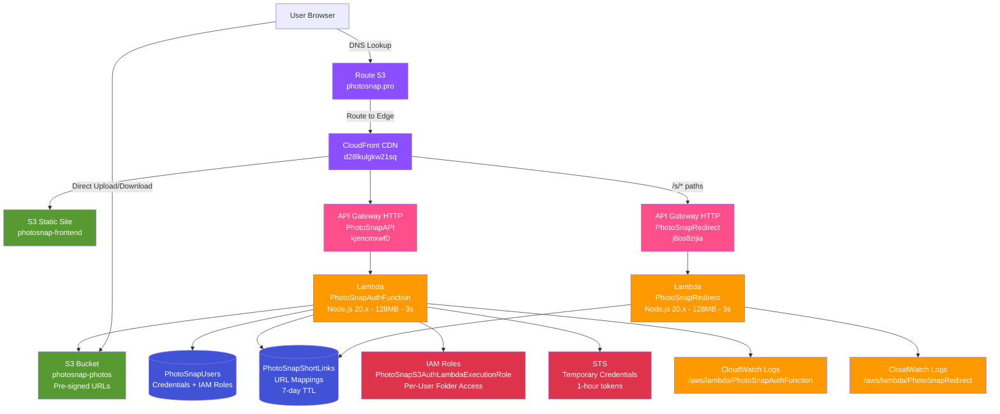

# PhotoSnap Pro - Serverless Photo Gallery with Viral Sharing

Production serverless photo gallery with secure authentication, direct S3 uploads via pre-signed URLs, and viral sharing through branded viewer pages with URL shortening for mobile compatibility.

**Live Demo:** [photosnap.pro](https://photosnap.pro)  
**Infrastructure:** Fully serverless AWS architecture with custom domain

---

## Architecture


---

## What It Does

- **Secure Authentication**: User signup/login with SHA256 password hashing and token-based password reset
- **Direct S3 Uploads**: Pre-signed URLs enable client-side uploads without exposing AWS credentials
- **Photo Gallery**: Grid view with modal viewer and secure deletion
- **Viral Sharing Loop**: Branded viewer page with marketing CTA converts shares into signups
- **URL Shortener**: Mobile-friendly short links (35 chars vs 2000+) prevent SMS/WhatsApp message splitting
- **Native Mobile Share**: iOS/Android share sheet integration with automatic clipboard fallback

---

## Architecture Decisions

**Pre-signed URL Pattern**
- Lambda generates time-limited, cryptographically signed S3 URLs (5min upload, 1hr view, 7-day share)
- Client uploads/downloads directly to S3 without proxying through Lambda
- Zero AWS credentials in browser or network traffic
- Automatic expiration revokes access without manual cleanup

**URL Shortener for Mobile UX**
- Share links were 2000+ characters, causing SMS/WhatsApp to split URLs across messages
- 6-character alphanumeric IDs (56 billion combinations) stored in DynamoDB with 7-day TTL
- CloudFront routes `/s/*` paths to redirect Lambda for instant resolution
- Reduced bandwidth, professional appearance, perfect mobile compatibility

**Viral Marketing Architecture**
- Share button generates viewer URL: `photosnap.pro/viewer.html?u=<base64-url>`
- Branded viewer displays photo with "Start Free Today" CTA
- Base64 encoding preserves AWS security tokens (prevents `+` sign corruption that breaks URLs)
- Converts every photo share into marketing opportunity (growth loop)

**Least-Privilege Security Model**
- Per-user IAM roles created dynamically on signup with folder-level S3 access only
- STS issues temporary credentials (1-hour expiry) for authenticated operations
- Lambda assumes user's role for pre-signed URL generation
- Eliminates need for Lambda to proxy S3 requests (lower cost, lower latency)

**Cost Optimization**
- DynamoDB on-demand pricing: $0 cost when idle
- Lambda 128MB memory: Right-sized for URL generation workload
- CloudFront caching: Reduces origin requests and Lambda invocations
- Direct S3 access: Eliminates Lambda data transfer costs
- TTL auto-expiration: Automatic cleanup of expired short links

**Performance**
- CloudFront global edge network for sub-100ms static asset delivery
- Direct S3 uploads bypass Lambda (no proxy overhead)
- Pre-signed URL caching: 1-hour validity reduces Lambda calls
- API Gateway HTTP API: Lightweight, low-latency alternative to REST API

**Scalability**
- Lambda auto-scales from 0 to 1000+ concurrent executions
- DynamoDB on-demand handles traffic spikes without capacity planning
- CloudFront distributes load across global edge locations
- Serverless architecture eliminates server management

**Trade-offs Made**
- SHA256 password hashing vs bcrypt (faster but less secure, acceptable for portfolio)
- 3-second Lambda timeout vs 30s (adequate for pre-signed URL generation)
- No WAF (saves $5/month, acceptable for low-traffic project)
- Would add for production: bcrypt, longer timeouts for batch operations, WAF for DDoS protection

---

## Tech Stack

**Backend**: Node.js 20.x, AWS Lambda (2 functions), Boto3  
**Storage**: 2 DynamoDB tables (on-demand), 2 S3 buckets  
**API**: 2 API Gateway HTTP APIs  
**CDN**: CloudFront (d28lkulgkw21sq.cloudfront.net)  
**DNS**: Route 53 (photosnap.pro)  
**Security**: AWS IAM (per-user roles), AWS STS (temporary credentials)  
**Monitoring**: CloudWatch Logs (2 log groups)  
**Encoding**: Base64 for URL parameter preservation

---

## Infrastructure Resources

**Compute**
- Lambda: PhotoSnapAuthFunction (auth, photos, URL shortening)
- Lambda: PhotoSnapRedirect (short link resolution)
- IAM: PhotoSnapS3AuthLambdaExecutionRole (shared execution role)

**Storage**
- DynamoDB: PhotoSnapUsers (credentials, IAM role ARNs)
- DynamoDB: PhotoSnapShortLinks (URL mappings with 7-day TTL)
- S3: photosnap-frontend-153600892207 (static website)
- S3: photosnap-photos-153600892207 (user photo storage)

**Networking**
- API Gateway HTTP: PhotoSnapAPI (kjencmxwf0) - main auth/photo endpoints
- API Gateway HTTP: PhotoSnapRedirect (j8os8zijia) - short link redirects
- CloudFront: E1G6FY0M8YYIVX (global CDN distribution)
- Route 53: photosnap.pro hosted zone (Z03582291W0DMC8P62WKI)

**Monitoring**
- CloudWatch: /aws/lambda/PhotoSnapAuthFunction
- CloudWatch: /aws/lambda/PhotoSnapRedirect

---

## Key Features

**Security Architecture**
- Pre-signed URLs eliminate AWS credentials in client code
- Per-user IAM roles with S3 folder isolation (`s3://bucket/username/*`)
- STS temporary credentials (1-hour expiry) for time-limited access
- SHA256 password hashing prevents plaintext credential storage
- HTTPS enforced via CloudFront with automatic HTTP → HTTPS redirect

**Mobile-First UX**
- Native share sheet on iOS/Android (`navigator.share` API)
- Automatic fallback to clipboard API on desktop browsers
- URL shortener prevents message splitting in SMS/WhatsApp/iMessage
- Responsive grid layout with touch-optimized controls

**Growth Marketing Integration**
- Branded viewer page with conversion-optimized CTA
- Every photo share becomes marketing opportunity
- Professional short links (photosnap.pro/s/abc123)
- Viral loop: viewers see PhotoSnap branding → sign up → share their photos

**Operational Resilience**
- CloudWatch logging for all Lambda invocations
- DynamoDB automatic multi-AZ replication
- S3 11-9's durability with cross-AZ redundancy
- CloudFront automatic failover across edge locations

---

## API Endpoints

**PhotoSnapAPI (kjencmxwf0)** - Main authentication and photo operations

| Endpoint | Action | Description |
|----------|--------|-------------|
| `/auth/auth` | signup | Create account, generate per-user IAM role |
| `/auth/auth` | login | Authenticate, return STS temporary credentials |
| `/auth/auth` | request-reset | Generate 6-digit reset token (15min expiry) |
| `/auth/auth` | reset-password | Reset password with token verification |
| `/auth/auth` | get-upload-url | Generate pre-signed PUT URL (5min expiry) |
| `/auth/auth` | list-photos | Return user photos with pre-signed GET URLs (1hr expiry) |
| `/auth/auth` | get-delete-url | Generate pre-signed DELETE URL (5min expiry) |
| `/auth/auth` | get-share-url | Generate pre-signed GET URL (7-day expiry) |
| `/auth/auth` | create-short-url | Generate 6-char short ID with DynamoDB mapping |

**PhotoSnapRedirect (j8os8zijia)** - URL shortener redirects

| Endpoint | Action | Description |
|----------|--------|-------------|
| `/s/{shortId}` | GET | Look up shortId in DynamoDB, 302 redirect to full URL |

---

## Key Stats

- **Response Time**: Sub-1-second for URL generation, instant redirects
- **Monthly Cost**: $0.50-$2 (Route 53 + minimal usage charges)
- **Availability**: 99.9%+ (serverless inherent reliability)
- **Infrastructure**: 2 Lambda functions, 2 DynamoDB tables, 2 S3 buckets, 2 API Gateways, CloudFront, Route 53
- **Short Link Capacity**: 56 billion unique combinations (6-char base62)

---

## What This Demonstrates

**Advanced Serverless Patterns**
- Pre-signed URL architecture for secure, direct client-S3 communication
- Dynamic IAM role creation for per-user resource isolation
- STS temporary credentials for time-limited access control
- URL shortening service with automatic TTL expiration

**Production Security Practices**
- Zero credentials in browser (pre-signed URLs only)
- Least-privilege IAM (folder-level S3 access per user)
- Base64 encoding for AWS token preservation in URLs
- HTTPS enforcement via CloudFront

**Growth Engineering**
- Viral sharing loop with branded viewer pages
- Mobile-first UX with native share sheet integration
- URL shortening prevents mobile messaging app issues
- Marketing CTA embedded in every shared photo

**Cloud Architecture**
- Multi-service AWS integration (Lambda, DynamoDB, S3, API Gateway, CloudFront, Route 53, IAM, STS)
- Custom domain with global CDN
- CloudWatch logging for observability
- Cost-optimized resource selection (on-demand pricing, right-sized Lambda)

**Full-Stack Development**
- Backend: Node.js Lambda with AWS SDK v3
- Frontend: Vanilla JavaScript with modern Web APIs (share, clipboard)
- Infrastructure: Multi-region DNS, global CDN, custom domain
- DevOps: Serverless deployment, zero server management

---

**Status**: Live in production at photosnap.pro  
**Monthly Cost**: $0.50-$2  
**Completed**: November 2025
**Region**: us-east-2

---

**Built with AWS | Secured with IAM + STS | Powered by Pre-signed URLs**
```
