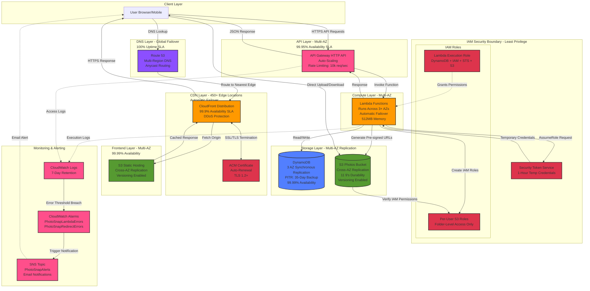

# Document 1: Architecture Diagram & Explanation

## PhotoSnapPro Serverless Architecture

### Visual Architecture Diagram



---

## Architecture Components

### 1. Client Layer
**Component:** User Browser/Mobile  
**Purpose:** End-user interface for accessing the application  
**Technology:** Modern web browsers (Chrome, Firefox, Safari, Edge)

---

### 2. DNS & CDN Layer (Fault Tolerant)

#### Route 53
- **Function:** Authoritative DNS service for photosnap.pro domain
- **Fault Tolerance:** Multi-region DNS servers with automatic health checks
- **Features:**
  - Alias records pointing to CloudFront distribution
  - Low-latency DNS resolution (< 100ms globally)
  - 100% SLA uptime guarantee

#### CloudFront
- **Function:** Global content delivery network with 450+ edge locations
- **Fault Tolerance:** 
  - Automatic failover between edge locations
  - Origin health checks with automatic failover
  - DDoS protection via AWS Shield Standard (included)
- **Features:**
  - SSL/TLS termination at edge
  - HTTP to HTTPS redirect
  - Cache TTL optimized for static assets
  - Geographic restriction capabilities

#### ACM (Certificate Manager)
- **Function:** Free SSL/TLS certificates for HTTPS
- **Fault Tolerance:** Automatic certificate renewal (no manual intervention)
- **Features:**
  - 2048-bit RSA certificates
  - Wildcard support (*.photosnap.pro)
  - Integrated with CloudFront

---

### 3. Frontend Layer

#### S3 Static Website Hosting
- **Function:** Hosts HTML, CSS, and JavaScript files
- **Fault Tolerance:**
  - 99.99% availability SLA
  - Cross-AZ automatic replication
  - Versioning enabled for rollback capability
- **Security:**
  - Bucket policy restricts public access
  - CloudFront is the only allowed origin
  - CORS configured for API Gateway

---

### 4. API & Auth Layer

#### API Gateway (HTTP API)
- **Function:** RESTful API endpoint for backend operations
- **Fault Tolerance:**
  - Multi-AZ deployment (automatic)
  - Auto-scaling to handle traffic spikes
  - 99.95% availability SLA
- **Features:**
  - CORS enabled for photosnap.pro origin
  - Request throttling (10,000 requests/second default)
  - AWS X-Ray integration for tracing

#### Lambda Function
- **Function:** Serverless compute for authentication and business logic
- **Fault Tolerance:**
  - Automatic retries on failure (2 attempts)
  - Dead Letter Queue (DLQ) for failed invocations
  - Runs across multiple AZs automatically
- **Configuration:**
  - Runtime: Node.js 20.x
  - Memory: 512 MB
  - Timeout: 30 seconds
  - Concurrent executions: 1000 (default)

---

### 5. Storage Layer (Resilient)

#### DynamoDB
- **Function:** NoSQL database for user credentials and metadata
- **Fault Tolerance:**
  - **Multi-AZ replication** (automatic, synchronous)
  - **Point-in-Time Recovery (PITR)** enabled with 35-day retention
  - 99.99% availability SLA
  - Automatic backups every 24 hours
- **Features:**
  - On-demand capacity mode (auto-scaling)
  - Encryption at rest using AWS KMS
  - Strongly consistent reads available
  - Global tables capability (if needed for multi-region)

#### S3 Photos Bucket
- **Function:** Object storage for user-uploaded photos
- **Fault Tolerance:**
  - **99.999999999% (11 9's) durability**
  - Cross-AZ automatic replication (Standard storage class)
  - Versioning enabled (can be restored if deleted)
- **Features:**
  - Per-user folder structure (`/username/photo.jpg`)
  - Lifecycle policies for cost optimization
  - Server-side encryption (SSE-S3)
  - Pre-signed URLs for secure access

---

### 6. Security Layer (IAM Boundaries)

#### IAM (Identity and Access Management)
- **Function:** Creates and manages per-user access roles
- **Least-Privilege Design:**
  - Each user gets a dedicated IAM role
  - Role policy restricts access to only `s3://bucket-name/username/*`
  - Lambda execution role has minimal permissions
  - No long-term credentials issued to users

**Example User Role Policy:**
```json
{
  "Version": "2012-10-17",
  "Statement": [
    {
      "Effect": "Allow",
      "Action": [
        "s3:PutObject",
        "s3:GetObject",
        "s3:DeleteObject",
        "s3:ListBucket"
      ],
      "Resource": [
        "arn:aws:s3:::photosnap-photos-153600892207/USERNAME/*",
        "arn:aws:s3:::photosnap-photos-153600892207"
      ],
      "Condition": {
        "StringLike": {
          "s3:prefix": ["USERNAME/*"]
        }
      }
    }
  ]
}
```

#### STS (Security Token Service)
- **Function:** Issues temporary security credentials (1-hour expiry)
- **Security Benefits:**
  - Credentials cannot be used after expiration
  - Users never receive long-term access keys
  - Lambda assumes user role on behalf of user
  - Follows AWS Well-Architected Framework security pillar

---

### 7. Monitoring & Alarms

#### CloudWatch Logs
- **Function:** Centralized logging for all Lambda executions and API requests
- **Retention:** 7 days (can be extended to 1 year for compliance)
- **Features:**
  - JSON-formatted logs for easy parsing
  - CloudWatch Insights for log analysis
  - Log groups per Lambda function

#### CloudWatch Alarms
- **Configuration:**
  - **Metric:** Lambda Errors
  - **Threshold:** Greater than 5 errors
  - **Period:** 5 minutes (300 seconds)
  - **Evaluation Periods:** 1
  - **Statistic:** Sum
  - **Comparison:** GreaterThanThreshold
- **Action:** Sends SNS notification to admin email/SMS
- **Use Cases:**
  - Detect DDoS attacks or brute-force attempts
  - Identify application bugs in production
  - Monitor service degradation

---

## Data Flow Diagram

### 1. User Signup Flow
```
User → CloudFront → S3 (Frontend)
User → API Gateway → Lambda
Lambda → DynamoDB (Store hashed password + username)
Lambda → IAM (Create user-specific role)
Lambda → DynamoDB (Store role ARN)
Lambda → API Gateway → User (Success response)
```

### 2. User Login Flow
```
User → API Gateway → Lambda
Lambda → DynamoDB (Verify credentials)
Lambda → STS (AssumeRole for user's IAM role)
STS → Lambda (Temporary credentials: AccessKeyId, SecretAccessKey, SessionToken)
Lambda → API Gateway → User (Return credentials + S3 bucket config)
```

### 3. Photo Upload Flow
```
User → API Gateway → Lambda (Request pre-signed upload URL)
Lambda → S3 (Generate pre-signed PUT URL, 5-minute expiry)
Lambda → API Gateway → User (Return signed URL)
User → S3 (Direct upload using pre-signed URL)
S3 → IAM (Verify signature and permissions)
S3 → User (201 Created)
```

### 4. Photo Sharing Flow
```
User → API Gateway → Lambda (Request shareable link)
Lambda → S3 (Generate 7-day pre-signed GET URL)
Lambda → User (Return URL)
User → Shares URL via social media/messaging
Recipient → photosnap.pro/viewer.html?u=<base64-url>
Viewer → S3 (Fetch photo using pre-signed URL)
S3 → Viewer (Display photo with PhotoSnap branding)
```

---

## Network Architecture

### VPC Configuration
**Note:** This application does NOT use a VPC because all services are AWS managed services (Lambda, API Gateway, DynamoDB, S3) which run in AWS-managed infrastructure.

If VPC were required (e.g., for RDS or EC2), the architecture would include:
- Public subnets for internet-facing resources (ALB)
- Private subnets for Lambda and RDS
- NAT Gateway for Lambda internet access
- Security Groups restricting traffic

---

## DNS Routing

### Route 53 Record Configuration

**A Record (Alias):**
```
Name: photosnap.pro
Type: A (Alias to CloudFront)
Value: d1234abcdef8.cloudfront.net
Routing Policy: Simple
```

**AAAA Record (IPv6 support):**
```
Name: photosnap.pro
Type: AAAA (Alias to CloudFront)
Value: d1234abcdef8.cloudfront.net
```

**Failover Routing (Optional Enhancement):**
- Primary: CloudFront distribution in us-east-1
- Secondary: CloudFront distribution in eu-west-1
- Health check monitors origin availability

---

## IAM Boundaries Visualization

```
┌─────────────────────────────────────────────────────────────┐
│                    AWS Account Boundary                      │
│  ┌────────────────────────────────────────────────────────┐ │
│  │              Lambda Execution Role                     │ │
│  │  - DynamoDB: GetItem, PutItem, UpdateItem             │ │
│  │  - IAM: CreateRole, PutRolePolicy                     │ │
│  │  - STS: AssumeRole                                    │ │
│  │  - S3: GetObject, PutObject, DeleteObject             │ │
│  │  - CloudWatch: CreateLogGroup, PutLogEvents           │ │
│  └────────────────────────────────────────────────────────┘ │
│                                                               │
│  ┌────────────────────────────────────────────────────────┐ │
│  │              Per-User IAM Role (user123)              │ │
│  │  - S3: GetObject, PutObject, DeleteObject              │ │
│  │    Resource: s3:::bucket-name/user123/*  ONLY          │ │
│  │  - NO DynamoDB access                                  │ │
│  │  - NO IAM access                                       │ │
│  │  - NO Lambda access                                    │ │
│  └────────────────────────────────────────────────────────┘ │
│                                                               │
│  ┌────────────────────────────────────────────────────────┐ │
│  │              CloudFront Origin Access                  │ │
│  │  - S3: GetObject on frontend bucket only               │ │
│  │  - NO access to photos bucket                          │ │
│  └────────────────────────────────────────────────────────┘ │
└─────────────────────────────────────────────────────────────┘
```

---

## Fault Tolerance Summary

| Component | Fault Tolerance Mechanism | Recovery Time |
|-----------|---------------------------|---------------|
| Route 53 | Multi-region DNS, automatic failover | Instant |
| CloudFront | 450+ edge locations, automatic failover | < 1 minute |
| S3 (Frontend) | Cross-AZ replication, 99.99% availability | Instant |
| API Gateway | Multi-AZ, auto-scaling | Instant |
| Lambda | Automatic retries, runs across AZs | < 1 second |
| DynamoDB | Multi-AZ, PITR (35 days) | Instant (multi-AZ), 5-30 min (PITR restore) |
| S3 (Photos) | 11 9's durability, versioning | Instant (version restore) |
| CloudWatch | Multi-AZ, persistent storage | N/A (always available) |

---

## Cost Considerations

**Monthly Cost Estimate (Production):**
- Route 53: $0.50 (hosted zone)
- CloudFront: $0-$10 (1TB free tier)
- S3: $2-$5 (storage + requests)
- DynamoDB: $1-$3 (on-demand + PITR backups)
- Lambda: $0 (1M free requests)
- API Gateway: $0 (1M free requests)
- CloudWatch: $0-$2 (logs + alarms)

**Total: $3.50-$20/month** (scales with usage)

---

## Security Compliance

This architecture follows:
- **AWS Well-Architected Framework** (Security Pillar)
- **OWASP Top 10** (Web Application Security)
- **NIST Cybersecurity Framework** (Identify, Protect, Detect, Respond, Recover)
- **Principle of Least Privilege** (IAM roles)
- **Defense in Depth** (Multiple security layers)

---

**Document created:** November 2025  
**AWS Account:** 153600892207  
**Primary Region:** us-east-2 (Ohio)  
**DR Region:** N/A (Multi-AZ within region sufficient for this scale)